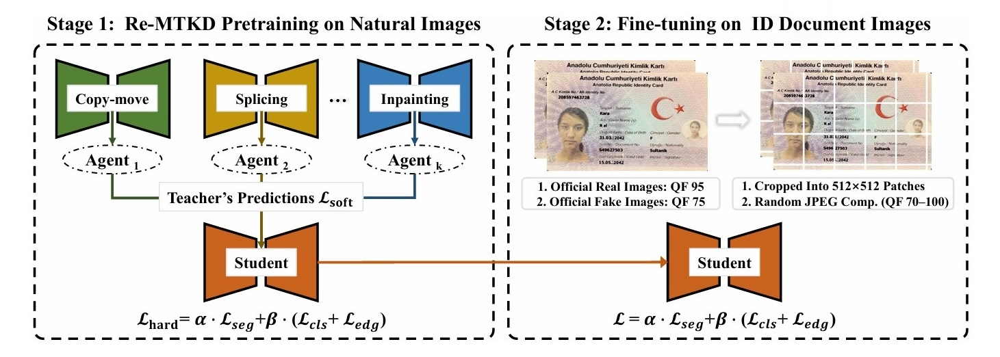
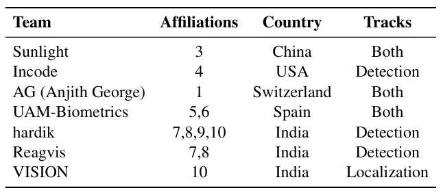
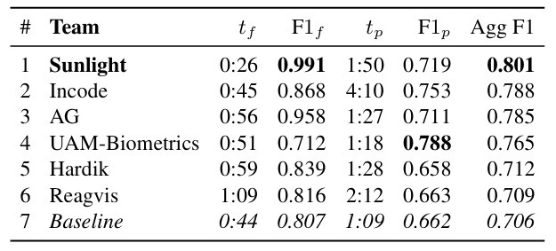
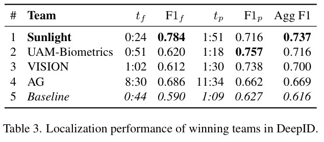

# DeepID 2025: The Challenge Of Detecting Synthetic Manipulations In ID Documents

<p align='center'>  
  
</p>

Both Tracks’ 1st Place Solution for [**The Challenge of Detecting Synthetic Manipulations in ID Documents (Detection  Track & Localization Track)**](https://deepid-iccv.github.io/) by **"Sunlight"** team.

Team members: **[Zeqin Yu](https://zeqinyu.github.io/aboutme/)**<sup>1</sup>, **Ye Tian**<sup>2</sup>, under the supervision of **[Prof. Jiangqun Ni](https://scst.sysu.edu.cn/members/members01/1408534.htm)**<sup>2,3</sup>.

<sup>1</sup> *School of Computer Science and Engineering, Sun Yat-sen University*  
<sup>2</sup> *School of Cyber Science and Engineering, Sun Yat-sen University*  
<sup>3</sup> *Peng Cheng Laboratory*


## Table of Contents

- [Overview](#Overview)
  - [Motivation](#Motivation)
  - [Organizers](#Organizers)
  - [Competition Details](#competition-details)
- [Dataset](#dataset)
  - [TrainSets](#TrainSets)
  - [TestSets](#TestSets)
  - [Examples](#Examples)

- [Our Solution](#our-solution)
  - [Preliminary Analysis](#preliminary-analysis)
  - [Proposed Pipeline](#proposed-pipeline)
- [Competition Results](#competition-results)
- [Acknowledgement](#acknowledgement)
  
## Overview 
### Motivation
With the advancements and wide spread of **visual generative models**, ID document tampering has become a pressing issue. **DeepID** is **the first competition** that challenges participants to detect synthetic manipulations (i.e., injection attacks (not presentation attacks)) in **ID documents**. 
#### The core objectives are:

- ✅ **Detecting face-swapping manipulations** when it was replaced using face swapping method in an ID document (card or passport).  
- ✅ **Detecting full or partial text inpainted** inside a textual fields of an ID documents, such as, names and dates, using diffusion-based or other generative techniques.
- ✅ **Performing automated visual forensics:**  binary classification and localization of forgeries in tampered ID documents.
- ✅ **Considering practical deployment** with hardware and software limitations in memory and computational resources for ID forgery detection systems.
###  Organizers

- [**Idiap Research Institute**](https://www.idiap.ch/en/) 
- [**PXL Vision**](https://www.pxl-vision.com/) 

---

### Competition Details

#### 🔹 Track 1: Binary classification ( bonafide vs. forged).

- **Input**: A single ID card image  
- **Output**: A score between 0 and 1  
  - Closer to 1: bonafide (real)  
  - Closer to 0: forged  
- **Evaluation**: F1-score (with a fixed threshold at 0.5)  
  F1 detection score is computed on the dataset from the predicted scores of each image using the `f1_score` function from scikit-learn as follows: `f1_score(labels, pred_labels, average='weighted')`. This means the F1-score is weighted per class (bonafide and attack), which is suitable for unbalanced data. A decision threshold of 0.5 is used, where 1 represents bonafide and 0 represents an attack.

---

#### 🔹 Track 2: Localization (mask of manipulated regions). 

- **Input**: A single ID image  
- **Output**: A binary mask with the same dimensions as the input  
  - Value 1: bonafide (clean)  
  - Value 0: forged/manipulated region  
- **Evaluation**: Image-level aggregated F1-score  
  F1 localization score is computed for each image independently as follows:  
```python
if sample.is_bonafide:
    # Fully bonafide image: the whole image is 1 (no altered regions), 
    # bonafide pixels are positives, zeros are negatives
    # We want high F1 if the model predicted mostly 1s (bonafide)
    tp = np.sum(mask == 1)  # all pixels should be 1s in the mask
    fn = np.sum(mask == 0)  # any zeros are falsely detected as a negative class
    tn = 0
    fp = 0
else:
    tn = np.sum(mask * gt_mask)
    tp = np.sum((~mask) * (~gt_mask))
    fp = np.sum((~mask) * gt_mask)
    fn = np.sum(mask * (~gt_mask))

precision = tp / (tp + fp + 1e-8)
recall = tp / (tp + fn + 1e-8)
f1 = 2 * precision * recall / (precision + recall + 1e-8) 
```
 - The final F1-score is the mean of two F1-score means computed for each bonafide and attack class: `(mean(bonafide_f1_scores) + mean(attack_f1_scores)) / 2`, ensuring that the class with more samples does not dominate the final F1-score.  
 - The aggregate F1-score is computed as a weighted average of the F1-scores on the Fantasy ID cards test set and the Private set of real documents: `f1_fantasy * 0.3 + f1_private * 0.7`, emphasizing the importance of the Private set.

---

## Dataset

### TrainSets

- **262 fantasy ID templates**, designed to mimic real ID documents of 10 countries  
- **786 bonafide images** captured using:
  - iPhone 15 Pro  
  - Huawei Mate 30  
  - Kyocera TASKalfa 2554ci scanner  
- **1,572 manipulated samples** created using:
  - 2 face-swapping techniques  
  - 2 text inpainting techniques  
- Faces are taken from public datasets:
  - AMFD, Face London, HQ-WMCA  
- Dataset will be released in **August 2025** under **CC BY 4.0**

---

### TestSets

####  In-domain Test Set

- Based on **new Fantasy ID cards**  
- Includes **novel manipulation techniques** not present in training  
- Evaluation leaderboard updated **daily**

####  Private Out-of-domain Test Set (Hidden)

- Provided by **PXL Vision** using **real ID documents** and corresponding forgeries  
- **Not publicly released**  
- Used for realism & generalization evaluation  
- Leaderboard updated **daily**

---


### Examples


#### 🟩 `original`
Original digital Fantasy ID card designs (before printing/scanning).

|Portugal |Turkiye  | Chinese |
|----------|----------|----------|
 |  |  | |


---

#### 🟦 `bonafide` 

Captured from printed ID cards using different devices.

##### iPhone 15 Pro

|Portugal |Turkiye  | Chinese |
|----------|----------|----------|
 |  |  | |


##### Huawei Mate 30

|Portugal |Turkiye  | Chinese |
|----------|----------|----------|
|  |  |  |

##### Kyocera TASKalfa 2554ci

|Portugal |Turkiye  | Chinese |
|----------|----------|----------|
|  | |   |

---

#### 🟥 `attack` (Digital Manipulations)

Manipulations include face-swapping and text inpainting.

---
#####  Digital Manipulations-1

######  iPhone 15 Pro

|Portugal |Turkiye  | Chinese |
|----------|----------|----------|
|  |  |  |


######  Huawei Mate 30

|Portugal |Turkiye  | Chinese |
|----------|----------|----------|
 |  |  | |


######  Kyocera TASKalfa 2554ci

|Portugal |Turkiye  | Chinese |
|----------|----------|----------|
 |  |  | |

---
#####  Digital Manipulations-2

######  iPhone 15 Pro

|Portugal |Turkiye  | Chinese |
|----------|----------|----------|
|  |  |  |


######  Huawei Mate 30

|Portugal |Turkiye  | Chinese |
|----------|----------|----------|
 |  |  | |


######  Kyocera TASKalfa 2554ci

|Portugal |Turkiye  | Chinese |
|----------|----------|----------|
 |  |  | |

---


## Our Solution
We proposed a two-stage training pipeline based on the **[Reinforced Multi-teacher Knowledge Distillation (Re-MTKD)](https://ojs.aaai.org/index.php/AAAI/article/view/32085)**  framework.

<p align="center">
  
  <br/>
  <em>Figure 1. Overview of our two-stage training pipeline.</em>
</p>


### Preliminary Analysis
**Analysis1:** We conducted an initial analysis to understand the domain-specific characteristics of the ID document images in the challenge. We observed that real and tampered images differ in JPEG compression quality (QF95 vs. QF75), and that the images feature structured layouts, clean backgrounds, and concentrated text regions. Such properties pose challenges for general-purpose image forgery detection and localization (IFDL) models, particularly in modeling compression artifacts and document-specific textures.

**Analysis2:** We also evaluated the zero-shot performance of several state-of-the-art IFDL methods, including MVSS-Net, TruFor (official baseline), and our own **[Re-MTKD](https://ojs.aaai.org/index.php/AAAI/article/view/32085)** . As shown in Tab.1, Re-MTKD achieved the highest F1 scores in both detection and localization despite being trained on fewer samples, indicating strong cross-domain generalization.

<div align="center">

<em> Table 1. Zero-shot performance (F1 score) of existing IFDL methods on the FantasyID validation set.</em>

| Method    | Data  | Detection | Localization | Average |
|:----------:|:-----:|:---------:|:------------:|:-------:|
| MVSS-Net  | 13k   | 0.533     | 0.187        | 0.360   |
| TruFor    | 876k  | 0.746     | 0.626        | 0.686   |
| Re-MTKD   | 60k   | 0.758     | 0.637        | 0.697   |


</div>

### Proposed Pipeline
In Stage 1 (left part of Fig. 1), we reused the Cue-Net student model pretrained using the Re-MTKD framework, which has shown strong generalization across various natural image forgery datasets. We trained teacher models, each focusing on a specific manipulation type (e.g., splicing, copy-move, inpainting), on datasets corresponding to each manipulation type, such as CASIAv2  for copy-move, FantasticReality for splicing, and GC for inpainting. We optimized the student model using a combination of soft distillation loss Lsoft and hard supervision loss Lhard, which combines segmentation, classification, and edge-aware losses to enhance detection accuracy and localization precision.

In Stage 2 (right part of Fig. 1), we fine-tuned the pretrained model on the FantasyID dataset to capture ID-specific characteristics such as structured layouts, subtle tampering traces, and compression-induced artifacts. We conducted training on 512×512 cropped patches with randomized JPEG compression (QF in [70, 100]) applied to simulate the diverse compression artifacts observed in the provided FantasyID dataset. During fine-tuning, we only optimized the hard supervision loss Lhard to ensure stable domain adaptation in the absence of the teacher’s guidance. At inference, we used whole-image processing to avoid resizing artifacts. This approach, when trained for 16 epochs, achieved first place in the detection track, and when trained for 31 epochs, first place in the localization track.

## Competition Results
The F1 scores ranking the winning teams (see Tab. 2) are reported in Tab. 3 for the detection track and in Tab. 4 for the localization track. The columns t₍f₎ and F1₍f₎ denote the inference time and F1 score on the FantasyID set, while t₍p₎ and F1₍p₎ correspond to the results on the private set.
<p align="center">
  <em> Table 2. The teams whose submissions scored above the TruFor baseline.</em>
  
  <br/>

</p>

<p align="center">
  <em> Table 3. Detection performance of winning teams in DeepID.</em>
  
  <br/>

</p>

<p align="center">
  <em> Table 4. Localization performance of winning teams in DeepID.</em>
  
  <br/>

</p>

Our team (**Sunlight**) achieves the fastest inference speed while performing both detection and localization. It ranks first on FantasyID and remains highly competitive on the private set. Overall, **Sunlight** secures the top position in the aggregated score across both tracks, demonstrating the superiority of our approach.


## Acknowledgement


<!-- ## 📊 Final Scoring (Aggregate F1 Score)

Final ranking uses a **weighted F1 score** formula:

$$
\text{Aggregate\_F1} = 0.3 \times \text{F1}_{\text{fantasy}} + 0.7 \times \text{F1}_{\text{private}}
$$


Where:

- `F1_fantasy` = average of F1 on bonafide and attack samples from the Fantasy test set  
- `F1_private` = F1-score on the private real document test set   -->


