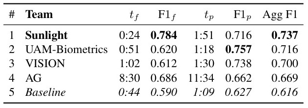

# 🏆 DeepID 2025: The Challenge Of Detecting Synthetic Manipulations In ID Documents

<p align='center'>  
  
</p>

Both Tracks’ 1st Place Solution for [**The Challenge of Detecting Synthetic Manipulations in ID Documents (Detection  Track & Localization Track)**](https://deepid-iccv.github.io/) by **"Sunlight"** team.

Team members: **[Zeqin Yu](https://zeqinyu.github.io/aboutme/)**<sup>1</sup>, Ye Tian<sup>2</sup>, under the supervision of **[Prof. Jiangqun Ni](https://scst.sysu.edu.cn/members/members01/1408534.htm)**<sup>2,3</sup>.

<sup>1</sup> *School of Computer Science and Engineering, Sun Yat-sen University*  
<sup>2</sup> *School of Cyber Science and Engineering, Sun Yat-sen University*  
<sup>3</sup> *Peng Cheng Laboratory*

## News
* **[2025.10.19]** 🔥🔥🔥 We were invited to **present our winning solution** at the **DeepID@ICCV 2025 Workshop**, held in conjunction with ICCV 2025 in Honolulu, Hawaii.
* **[2025.10.18]** 🔥🔥 We have compiled a list of competitions and resources related to Text Image Forensics, [available here.](#additional-competitions-and-resources-on-text-image-forensics)
* **[2025.10.18]** 🔥 We have open-sourced our **competition test code and pretrained weights** for the DeepID 2025 Challenge, [available here.](https://github.com/ZeqinYu/ICCV-DeepID2025-Sunlight)
* **[2025.09.11]** We updated our solution.

## Table of Contents

- [Our Solution](#our-solution)
  - [Preliminary Analysis](#preliminary-analysis)
  - [Proposed Pipeline](#proposed-pipeline)
  - [Testing Our Pipeline](#testing-our-pipeline)
- [Competition Results](#competition-results)
- [Additional Competitions and Resources on Text Image Forensics](#additional-competitions-and-resources-on-text-image-forensics)
- [Citation](#citation)
  


## Our Solution

### 🔍 Preliminary Analysis
*A more detailed background analysis can be found in [Background.md](./Background.md).*

**Analysis1:** We conducted an initial analysis to understand the domain-specific characteristics of the ID document images in the challenge. We observed that real and tampered images differ in JPEG compression quality (QF95 vs. QF75), and that the images feature structured layouts, clean backgrounds, and concentrated text regions. Such properties pose challenges for general-purpose image forgery detection and localization (IFDL) models, particularly in modeling compression artifacts and document-specific textures.

**Analysis2:** We also evaluated the zero-shot performance of several state-of-the-art IFDL methods, including MVSS-Net, TruFor (official baseline), and our own **[Re-MTKD](https://ojs.aaai.org/index.php/AAAI/article/view/32085)** . As shown in Tab.1, Re-MTKD achieved the highest F1 scores in both detection and localization despite being trained on fewer samples, indicating strong cross-domain generalization.

<div align="center">

<em> Table 1. Zero-shot performance (F1 score) of existing IFDL methods on the FantasyID validation set.</em>

| Method    | Data  | Detection | Localization | Average |
|:----------:|:-----:|:---------:|:------------:|:-------:|
| MVSS-Net  | 13k   | 0.533     | 0.187        | 0.360   |
| TruFor    | 876k  | 0.746     | 0.626        | 0.686   |
| Re-MTKD   | 60k   | 0.758     | 0.637        | 0.697   |


</div>

### 🧩 Proposed Pipeline
We proposed a two-stage training pipeline based on the **[Reinforced Multi-teacher Knowledge Distillation (Re-MTKD)](https://ojs.aaai.org/index.php/AAAI/article/view/32085)**  framework.

<p align="center">
  
  <br/>
  <em>Figure 1. Overview of our two-stage training pipeline.</em>
</p>

In Stage 1 (left part of Fig. 1), we reused the Cue-Net student model pretrained using the Re-MTKD framework, which has shown strong generalization across various natural image forgery datasets. We trained teacher models, each focusing on a specific manipulation type (e.g., splicing, copy-move, inpainting), on datasets corresponding to each manipulation type, such as CASIAv2  for copy-move, FantasticReality for splicing, and GC for inpainting. We optimized the student model using a combination of soft distillation loss Lsoft and hard supervision loss Lhard, which combines segmentation, classification, and edge-aware losses to enhance detection accuracy and localization precision.

In Stage 2 (right part of Fig. 1), we fine-tuned the pretrained model on the FantasyID dataset to capture ID-specific characteristics such as structured layouts, subtle tampering traces, and compression-induced artifacts. We conducted training on 512×512 cropped patches with randomized JPEG compression (QF in [70, 100]) applied to simulate the diverse compression artifacts observed in the provided FantasyID dataset. During fine-tuning, we only optimized the hard supervision loss Lhard to ensure stable domain adaptation in the absence of the teacher’s guidance. At inference, we used whole-image processing to avoid resizing artifacts. This approach, when trained for 16 epochs, achieved first place in the detection track, and when trained for 31 epochs, first place in the localization track.

### 🧪 Testing Our Pipeline

Assuming you are running this code on computer with nvidia GPU and docker, you can run [Re-MTKD](https://github.com/ZeqinYu/Re-MTKD) through the API. Start the model API with:

```bash
docker compose up -d --build
```

and then you can test the API with:

```bash
pytest -sv test_api.py
```

You will need a Python environment with `pytest requests numpy pillow` installed to run the tests. This will be the output of the tests for Re-MTKD:

```text
===================================================================================== test session starts =====================================================================================
platform linux -- Python 3.11.13, pytest-8.4.1, pluggy-1.6.0 -- /home/zyserver/anaconda3/envs/deepid/bin/python3.11
cachedir: .pytest_cache
rootdir: /home/tianye/code/baseline-docker-maincnet
collected 5 items                                                                                                                                                                                       

test_api.py::test_server_is_running PASSED
test_api.py::test_detect_endpoint 
Pristine image pristine1.jpg score: 0.93
Tampered image tampered1.png score: 0.00
PASSED
test_api.py::test_localize_endpoint 
Pristine image pristine1.jpg white percentage: 100.00%
Tampered image tampered1.png black percentage: 15.46%
PASSED
test_api.py::test_detect_and_localize_endpoint 
Pristine image pristine1.jpg detect_and_localize score: 0.93, white percentage: 100.00%
Tampered image tampered1.png detect_and_localize score: 0.00, black percentage: 15.46%
PASSED
test_api.py::test_api_compliance API compliance test passed!
PASSED

======================================================================= 5 passed in 5.47s ========================================================================
```

**Note: The pretrained weights can be downloaded from [Google Drive]() or [Baidu Pan](), and place the weights into "/yourpath/baseline-docker-maincnet/src/Cue_Net/ck".**


## 🏆 Competition Results
The F1 scores ranking the winning teams (see Tab. 2) are reported in Tab. 3 for the detection track and in Tab. 4 for the localization track. The columns t₍f₎ and F1₍f₎ denote the inference time and F1 score on the FantasyID set, while t₍p₎ and F1₍p₎ correspond to the results on the private set.

<p align="center">
  <em> Table 2. The teams whose submissions scored above the TruFor baseline.</em>
  <br/>
  
  

</p>

<p align="center">
  <em> Table 3. Detection performance of winning teams in DeepID.</em>
   <br/>
  
 

</p>

<p align="center">
  <em> Table 4. Localization performance of winning teams in DeepID.</em>
  <br/>
  
  

</p>

Our team (**Sunlight**) achieves the fastest inference speed while performing both detection and localization. It ranks first on FantasyID and remains highly competitive on the private set. Overall, **Sunlight** secures the top position in the aggregated score across both tracks, demonstrating the superiority of our approach.

## 📚 Additional Competitions and Resources on Text Image Forensics
This list provides an overview of major competitions and resources related to **Text Image Forgery Detection and Localization**, based on our experiences of contributing dataset support to the [Real-world Image Forgery Localization Challenge (2022)](https://tianchi.aliyun.com/competition/entrance/531945/introduction) and winning First Place in both the Detection and Localization tracks of the [ICCV 2025 DeepID Challenge](https://deepid-iccv.github.io/) (Team: Sunlight).  
Contributions are welcome! If you have additional competitions or resources related to text image forgery, feel free to reach out: 📧 kimjyu@foxmail.com.
| Year | Competition | Organizer | Representative Solution | Data (Real/Fake) | Notes & Download |
| ---- | ----------- | --------- | ----------------------- | ---------------- | ----- |
| 2018 | [ICPR 2018 Fraud Detection](http://findit.univ-lr.fr/) | University of La Rochelle (France) | [Official Challenge Report](https://ieeexplore.ieee.org/document/8545428) | -/180 | [Download Link](http://findit.univ-lr.fr/download-the-dataset/) <br> (Receipts )|
| 2021 | [安全AI挑战者计划第五期：伪造图像的篡改检测](https://tianchi.aliyun.com/competition/entrance/531812/introduction) | Alibaba Security (China) | [First Place (University of Macau)](https://github.com/HighwayWu/Tianchi-FFT1) | -/2,005 | [Download Link](https://tianchi.aliyun.com/competition/entrance/531812/introduction) <br> (Book cover, partially collected from [DFCN](https://ieeexplore.ieee.org/abstract/document/9393396/); Certificate) |
| 2022 | [Real-world Image Forgery Localization Challenge <br> (真实场景篡改图像检测挑战赛) ](https://tianchi.aliyun.com/competition/entrance/531945/introduction)| Alibaba Security (China) | [First Place (University of Chinese Academy of Sciences)](https://github.com/Junjue-Wang/Rank1-Ali-Tianchi-Real-World-Image-Forgery-Localization-Challenge?spm=a2c22.21852664.0.0.1873734dyJjJdi) | -/4,000 | [Download Link](https://tianchi.aliyun.com/competition/entrance/531945/information) <br> ([Screenshot images](https://github.com/ZeqinYu/STFL-Net), partially collected from [STFD](https://ieeexplore.ieee.org/abstract/document/10095070/) )|
| 2023 | [ICDAR 2023 DTT in Images 1: Text Manipulation Classification](https://tianchi.aliyun.com/competition/entrance/532048/introduction) | Alibaba Security (China) | [First Place ( Bytedance-Douyin)](https://blog.csdn.net/ByteDanceTech/article/details/131218802), <br> [Official Challenge Report](https://link.springer.com/chapter/10.1007/978-3-031-41679-8_36)|  4,285/4,000  | [Download Link](https://tianchi.aliyun.com/competition/entrance/532048/information) <br> (Partially collected from [STFD](https://ieeexplore.ieee.org/abstract/document/10095070/), [RTM](https://www.sciencedirect.com/science/article/abs/pii/S003132032400579X)) |
| 2023 | [ICDAR 2023 DTT in Images 2: Text Manipulation Detection](https://tianchi.aliyun.com/competition/entrance/532052/introduction) | Alibaba Security (China) | First Place (IntSig Information), <br> [Official Challenge Report](https://link.springer.com/chapter/10.1007/978-3-031-41679-8_36) | 4,285/4,000 | [Download Link](https://tianchi.aliyun.com/competition/entrance/532052/information) <br> (Partially collected from [STFD](https://ieeexplore.ieee.org/abstract/document/10095070/), [RTM](https://www.sciencedirect.com/science/article/abs/pii/S003132032400579X)) |
| 2023 | [AFAC 2023 – Financial Data Scenarios: Track 1 – Financial Document Anti-forgery <br> (AFAC2023-金融数据场景-赛题1 金融文档防篡改)](https://tianchi.aliyun.com/competition/entrance/532096/information) | Ant Group (China) | - | 7,338/5,632 | [Download Link](https://tianchi.aliyun.com/competition/entrance/532096/information) |
| 2024 | [Global AI Security Challenge 2024 – Track 3: ID Forgery Detection in Financial Scenarios <br> (全球AI攻防挑战赛—赛道二：AI核身之金融场景凭证篡改检测)](https://tianchi.aliyun.com/competition/entrance/532267/introduction) | Ant Group (China) | - | - | [Download Link](https://tianchi.aliyun.com/competition/entrance/532267/information) |
| 2025 | [ICCV 2025: The Challenge of Detecting Synthetic Manipulations in ID Documents (DeepID 2025) - Detection Track](https://deepid-iccv.github.io/) | Idiap Research Institute, PXL Vision (Switzerland)| [First Place (Sun Yat-sen University)](https://github.com/ZeqinYu/ICCV-DeepID2025-Sunlight), <br> [Official Challenge Report](https://publications.idiap.ch/attachments/papers/2025/Korshunov_ICCV_2025.pdf) | Train: 633/1,266 <br> Test: 300/1,085 |  [Download Link](https://zenodo.org/records/17063366) <br> (ID cards)  |
| 2025 | [ICCV 2025: The Challenge of Detecting Synthetic Manipulations in ID Documents (DeepID 2025) - Localization Track](https://deepid-iccv.github.io/) | Idiap Research Institute, PXL Vision (Switzerland)| [First Place (Sun Yat-sen University)](https://github.com/ZeqinYu/ICCV-DeepID2025-Sunlight), <br> [Official Challenge Report](https://publications.idiap.ch/attachments/papers/2025/Korshunov_ICCV_2025.pdf) | Train: 633/1,266 <br> Test: 300/1,085 | [Download Link](https://zenodo.org/records/17063366) <br> (ID cards) |

## ✍️ Citation
```bibtex
@inproceedings{yu2025reinforced,
  title={Reinforced Multi-teacher Knowledge Distillation for Efficient General Image Forgery Detection and Localization},
  author={Yu, Zeqin and Ni, Jiangqun and Zhang, Jian and Deng, Haoyi and Lin, Yuzhen},
  booktitle={Proceedings of the AAAI Conference on Artificial Intelligence},
  volume={39},
  number={1},
  pages={995--1003},
  year={2025}
}


