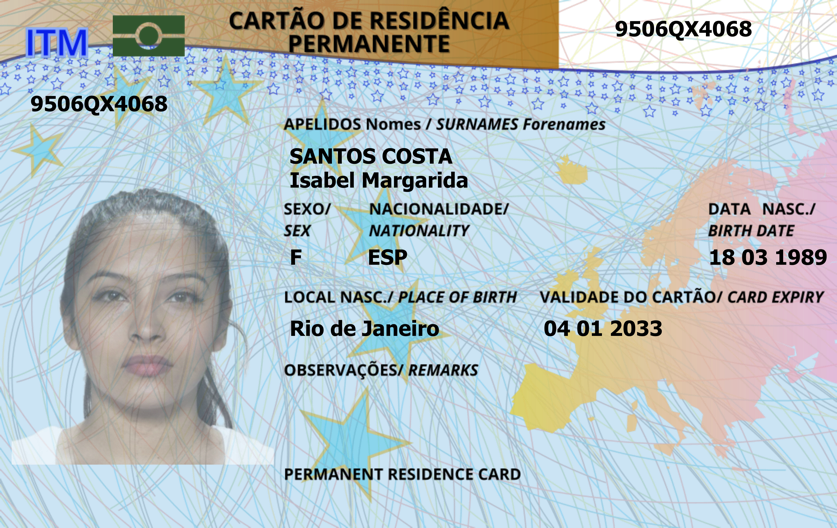

# DeepID 2025: The Challenge Of Detecting Synthetic Manipulations In ID Documents

<p align='center'>  
  
</p>

Both Tracks’ 1st Place Solution for [**The Challenge of Detecting Synthetic Manipulations in ID Documents (Detection  Track & Localization Track)**](https://deepid-iccv.github.io/) by **"Sunlight"** team.

## Table of Contents

- [Overview](#Overview)
  - [Motivation](#Motivation)
  - [Organizers](#Organizers)
  - [Competition Details](#competition-details)
- [Dataset](#dataset)
  - [TrainSets](#TrainSets)
  - [TestSets](#TestSets)
  - [Examples](#Examples)
- [Our Solution](#our-solution)
- [Acknowledgement](#acknowledgement)
  
## Overview 
### Motivation
With the advancements and wide spread of **visual generative models**, ID document tampering has become a pressing issue. **DeepID** is **the first competition** that challenges participants to detect synthetic manipulations (i.e., injection attacks (not presentation attacks)) in **ID documents**. 
#### The core objectives are:

- ✅ **Detecting face-swapping manipulations** when it was replaced using face swapping method in an ID document (card or passport).  
- ✅ **Detecting full or partial text inpainted** inside a textual fields of an ID documents, such as, names and dates, using diffusion-based or other generative techniques.
- ✅ **Performing automated visual forensics:**  binary classification and localization of forgeries in tampered ID documents.
- ✅ **Considering practical deployment** with hardware and software limitations in memory and computational resources for ID forgery detection systems.
###  Organizers

- [**Idiap Research Institute**](https://www.idiap.ch/en/) 
- [**PXL Vision**](https://www.pxl-vision.com/) 

---

### Competition Details

#### 🔹 Track 1: Binary classification ( bonafide vs. forged).

- **Input**: A single ID card image  
- **Output**: A score between 0 and 1  
  - Closer to 1: bonafide (real)  
  - Closer to 0: forged  
- **Evaluation**: F1-score (with a fixed threshold at 0.5)  
  F1 detection score is computed on the dataset from the predicted scores of each image using the `f1_score` function from scikit-learn as follows: `f1_score(labels, pred_labels, average='weighted')`. This means the F1-score is weighted per class (bonafide and attack), which is suitable for unbalanced data. A decision threshold of 0.5 is used, where 1 represents bonafide and 0 represents an attack.

---

#### 🔹 Track 2: Localization (mask of manipulated regions). 

- **Input**: A single ID image  
- **Output**: A binary mask with the same dimensions as the input  
  - Value 1: bonafide (clean)  
  - Value 0: forged/manipulated region  
- **Evaluation**: Image-level aggregated F1-score  
  F1 localization score is computed for each image independently as follows:  
```python
if sample.is_bonafide:
    # Fully bonafide image: the whole image is 1 (no altered regions), 
    # bonafide pixels are positives, zeros are negatives
    # We want high F1 if the model predicted mostly 1s (bonafide)
    tp = np.sum(mask == 1)  # all pixels should be 1s in the mask
    fn = np.sum(mask == 0)  # any zeros are falsely detected as a negative class
    tn = 0
    fp = 0
else:
    tn = np.sum(mask * gt_mask)
    tp = np.sum((~mask) * (~gt_mask))
    fp = np.sum((~mask) * gt_mask)
    fn = np.sum(mask * (~gt_mask))

precision = tp / (tp + fp + 1e-8)
recall = tp / (tp + fn + 1e-8)
f1 = 2 * precision * recall / (precision + recall + 1e-8) 
```
 - The final F1-score is the mean of two F1-score means computed for each bonafide and attack class: `(mean(bonafide_f1_scores) + mean(attack_f1_scores)) / 2`, ensuring that the class with more samples does not dominate the final F1-score.  
 - The aggregate F1-score is computed as a weighted average of the F1-scores on the Fantasy ID cards test set and the Private set of real documents: `f1_fantasy * 0.3 + f1_private * 0.7`, emphasizing the importance of the Private set.

---

## Dataset

### TrainSets

- **262 fantasy ID templates**, designed to mimic real ID documents of 10 countries  
- **786 bonafide images** captured using:
  - iPhone 15 Pro  
  - Huawei Mate 30  
  - Kyocera TASKalfa 2554ci scanner  
- **1,572 manipulated samples** created using:
  - 2 face-swapping techniques  
  - 2 text inpainting techniques  
- Faces are taken from public datasets:
  - AMFD, Face London, HQ-WMCA  
- Dataset will be released in **August 2025** under **CC BY 4.0**

---

### TestSets

####  In-domain Test Set

- Based on **new Fantasy ID cards**  
- Includes **novel manipulation techniques** not present in training  
- Evaluation leaderboard updated **daily**

####  Private Out-of-domain Test Set (Hidden)

- Provided by **PXL Vision** using **real ID documents** and corresponding forgeries  
- **Not publicly released**  
- Used for realism & generalization evaluation  
- Leaderboard updated **daily**

---


### Examples


#### 🟩 `original`
Original digital Fantasy ID card designs (before printing/scanning).

|Portugal |Turkiye  | Chinese |
|----------|----------|----------|
 |  |  | |


---

#### 🟦 `bonafide` 

Captured from printed ID cards using different devices.

##### iPhone 15 Pro

|Portugal |Turkiye  | Chinese |
|----------|----------|----------|
 |  |  | |


##### Huawei Mate 30

|Portugal |Turkiye  | Chinese |
|----------|----------|----------|
|  |  |  |

##### Kyocera TASKalfa 2554ci

|Portugal |Turkiye  | Chinese |
|----------|----------|----------|
|  | |   |

---

#### 🟥 `attack` (Digital Manipulations)

Manipulations include face-swapping and text inpainting.

---
#####  Digital Manipulations-1

######  iPhone 15 Pro

|Portugal |Turkiye  | Chinese |
|----------|----------|----------|
|  |  |  |


######  Huawei Mate 30

|Portugal |Turkiye  | Chinese |
|----------|----------|----------|
 |  |  | |


######  Kyocera TASKalfa 2554ci

|Portugal |Turkiye  | Chinese |
|----------|----------|----------|
 |  |  | |

---
#####  Digital Manipulations-2

######  iPhone 15 Pro

|Portugal |Turkiye  | Chinese |
|----------|----------|----------|
|  |  |  |


######  Huawei Mate 30

|Portugal |Turkiye  | Chinese |
|----------|----------|----------|
 |  |  | |


######  Kyocera TASKalfa 2554ci

|Portugal |Turkiye  | Chinese |
|----------|----------|----------|
 |  |  | |

---

## Our Solution

## Acknowledgement


<!-- ## 📊 Final Scoring (Aggregate F1 Score)

Final ranking uses a **weighted F1 score** formula:

$$
\text{Aggregate\_F1} = 0.3 \times \text{F1}_{\text{fantasy}} + 0.7 \times \text{F1}_{\text{private}}
$$


Where:

- `F1_fantasy` = average of F1 on bonafide and attack samples from the Fantasy test set  
- `F1_private` = F1-score on the private real document test set   -->
